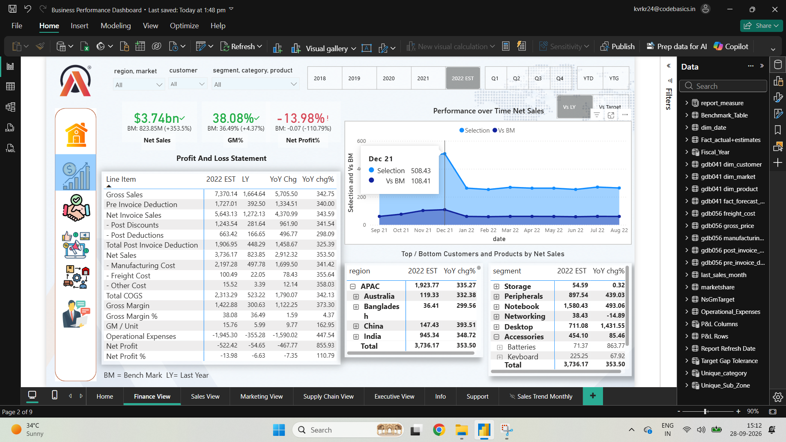
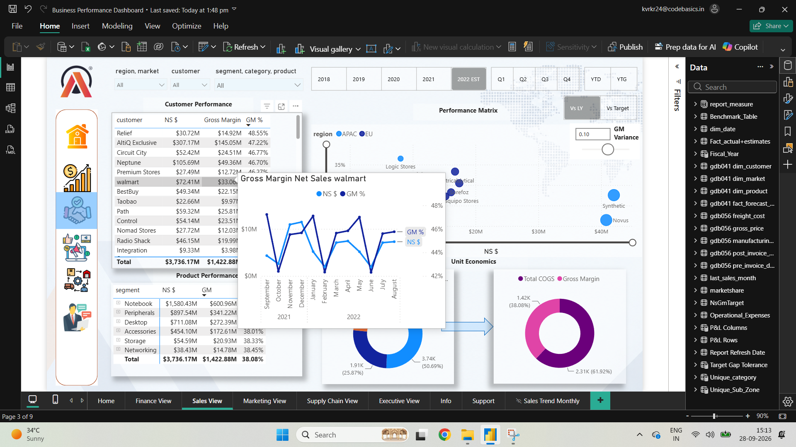
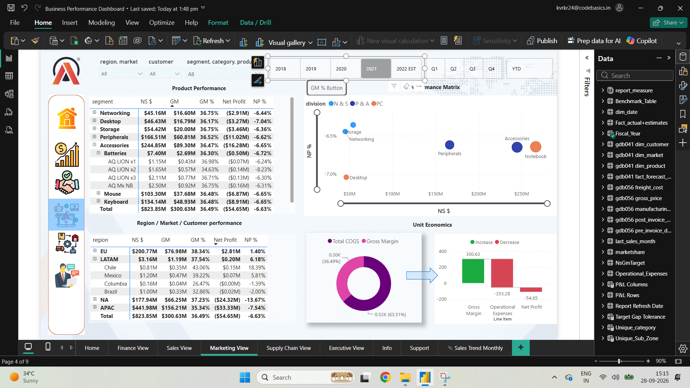
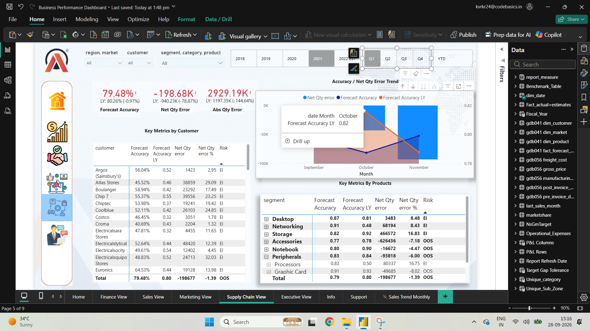
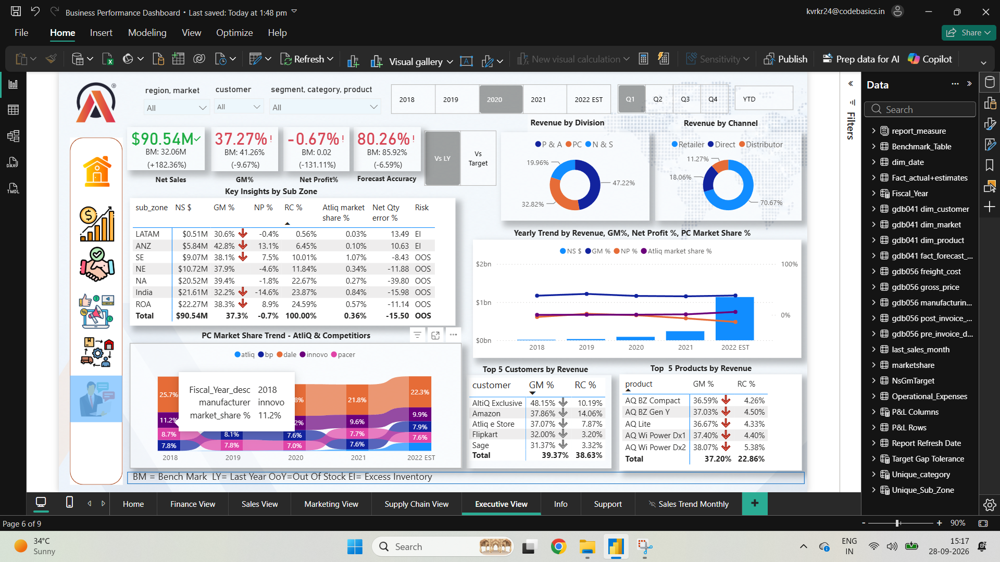
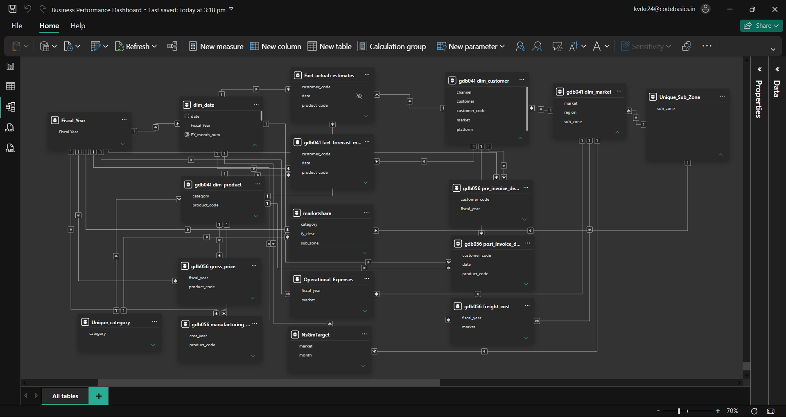

# Business Performance Dashboard

## Power BI Business Intelligence Project

An end-to-end Power BI business analytics dashboard designed to
provide a 360° view of business performance across Finance, Sales,
Marketing, Supply Chain, and Executive reporting.

### Power BI Dashboard Overview

[▶ Watch the Dashboard Overview](assets/Overview.mp4)

The dashboard enables users to analyse **revenue, profitability,
customer performance, product performance, market share, forecast
accuracy, inventory risk, and business trends** using interactive
filters, fiscal-year selections, drill-downs, and time-intelligence
views.

------------------------------------------------------------------------

## Project Objective

The objective is to create a single, company-wide BI environment where people across different countries, markets, regions and functions can understand business performance without relying on separate reports for every team.

A regional manager can focus on their own market. A Sales team can investigate customers. Finance can trace the P&L. Supply Chain can investigate forecast and inventory issues. Executives can step back and see the complete picture.

| User / Team | Level of Analysis | Main Questions |
|---|---|---|
| Executive Management | Company-wide | How is the overall business performing? |
| Regional / Market Managers | Region / Market | What is happening in my geography? |
| Sales Team | Customer / Region / Channel | Which customers and channels are driving sales and margin? |
| Marketing Team | Product / Segment / Market | Which products and segments are driving business performance? |
| Finance Team | P&L / Cost / Margin | Where is revenue being generated and where is profitability being lost? |
| Supply Chain Team | Product / Customer / Forecast | How accurate is demand planning and where are inventory risks? |

---

## AtliQ Hardware — The Business Model

AtliQ Hardware reaches the market through three primary sales channels:

| Sales Channel | Role in the Business |
|---|---|
| Retailer | Products are sold through retail partners who serve end customers. |
| Direct | AtliQ sells directly to customers through its direct sales channel. |
| Distributor | Distributors help AtliQ reach and serve customers across different markets and regions. |

These channels create different levels of business performance across markets, regions, customers and products. The dashboard makes those differences visible so teams can move from a company-level result to the underlying business drivers.

Business model flow:

Products → Sales Channels → Customers → Markets / Regions → Revenue → Costs & Deductions → **Gross Margin** → Operating Expenses → **Net Profit**

---

## The Business Story

In the earlier stages of growth, AtliQ's business can be viewed through the lens of market expansion and market-share growth. The **Executive View** brings this broader picture together, allowing management to observe how the company's market position develops alongside revenue and profitability.

However, gaining market share and generating revenue do not automatically result in strong net profitability.

The 2022 Estimate snapshot shows:

| KPI | 2022 Estimate |
|---|---:|
| **Net Sales** | **$3.74 Billion** |
| **Gross Margin** | **38.08%** |
| **Gross Margin** Value | $1.42 Billion |
| **Net Profit** % | **-13.98%** |
| **Net Profit** | **-$522.42 Million** |
| **Forecast Accuracy** | **81.17%** |

This creates the central business question:

> **AtliQ has built significant revenue and market presence - how can that growth be converted into sustainable profitability?**

The dashboard allows teams to investigate the possible drivers rather than stopping at the headline KPI.

Finance can trace sales, deductions, manufacturing costs, freight costs and operating expenses. Sales can investigate customers, regions and channels. Marketing can examine product and segment performance. Supply Chain can investigate forecast accuracy and inventory risks.

From a strategic perspective, management can then evaluate opportunities such as better discount management, cost optimization, operational efficiency, and improving the customer/product mix.

These are potential management actions to investigate - the dashboard itself provides the evidence needed to evaluate them.

---

# Business Snapshot

The latest reporting view highlights the relationship between scale, margin, profitability and operational execution:

- $3.74B **Net Sales** shows the scale of the business.
- **38.08%** **Gross Margin** indicates meaningful value remains after direct costs.
- **-13.98%** **Net Profit** shows that the business still faces substantial pressure below gross margin.
- **81.17%** **Forecast Accuracy** shows improvement in demand planning, while remaining forecast gaps can still affect inventory and service levels.

The important point is not any single KPI. It is the relationship between them.

**Revenue tells us how much the business generates.  
Margin tells us what remains after direct costs.  
**Net Profit** tells us what remains after the wider cost structure.  
**Forecast Accuracy** tells us how well the business is planning demand.**

# Home View

### Dashboard Preview

### Starting the Journey

The Home View is the entry point to the business story. Instead of forcing every user through the same analysis, it directs users toward the view that matches their business question.

A user can move from the company-wide picture into Finance, Sales, Marketing, Supply Chain or Executive analysis, and then drill down into the details behind the numbers.

### Key Features

-   Navigation to Finance, Sales, Marketing, Supply Chain and Executive
    views
-   Access to the Sales Trend Monthly analysis
-   Consistent navigation across the report
-   Designed as the starting point for users exploring the dashboard

### Business Purpose

The Home View provides a single entry point into the complete business
reporting solution, allowing users to move from high-level reporting
into detailed functional analysis.

------------------------------------------------------------------------

# **Finance View**

### Dashboard Preview

The **Finance View** focuses on **Profit & Loss analysis and financial
performance**.

### Key Metrics

| Metric | Purpose |
|---|---|
| **Net Sales** | Measures total revenue generated |
| **Gross Margin** % | Measures profitability after direct costs |
| **Net Profit** % | Measures final profitability after operating expenses |
| **Gross Margin** Value | Measures gross profit in monetary terms |
| **Net Profit** | Measures final profit or loss |
| Year-over-Year | Compares current performance with the previous year |
| Benchmark / Target | Compares performance against reference values |

### Major Analysis

-   Detailed Profit & Loss statement
-   Gross Sales and deductions
-   Manufacturing costs
-   Freight costs
-   Operational expenses
-   Regional financial performance
-   Product-segment financial performance
-   Previous-year and benchmark comparisons

### Major Business Insights

-   **Net Sales** of approximately \$3.74B demonstrates significant
    revenue generation.
-   **Gross Margin** of **38.08%** indicates that a substantial portion of
    revenue remains after direct costs.
-   However, **Net Profit** is approximately -\$522.42M, resulting in a
    **-13.98%** **Net Profit** margin.
-   This shows that the major profitability pressure occurs after gross
    margin, making the lower sections of the P&L important for
    understanding cost and expense drivers.
-   The P&L structure allows users to trace the movement from **Gross
    Sales → deductions → **Net Sales** → manufacturing/freight costs → Gross
    Margin → operating expenses → **Net Profit****.

------------------------------------------------------------------------

# **Sales View**

### Dashboard Preview

The **Sales View** turns company revenue into a detailed customer and market story.

It helps answer questions such as: Which customers contribute most to revenue? Which customers generate stronger margins? How does performance differ across APAC, EU, LATAM and North America?

This is important because two customers with similar revenue can contribute very differently to profitability.

### Key Metrics & Analysis

-   **Net Sales**
-   **Gross Margin** %
-   Customer contribution
-   Market / regional performance
-   Customer-level profitability
-   Product and category performance
-   Year-over-Year comparisons
-   Top customer analysis

### Customer Insights

| Customer | Net Sales | Gross Margin % |
|---|---:|---:|
| Amazon | $496.88M | 36.78% |
| AtliQ Exclusive | $361.21M | 46.01% |
| AtliQ eStore | $304.10M | 36.88% |
| Flipkart | $138.49M | 42.14% |
| Sage | $127.85M | 31.53% |

### Major Business Insights

-   Amazon contributes approximately \$496.88M in **Net Sales**, making
    it a major contributor to overall revenue.
-   AtliQ Exclusive generates approximately \$361.21M while
    showing a 46.01% **Gross Margin**, demonstrating that revenue
    contribution and margin contribution can differ across customers.
-   Sage shows approximately 31.53% **Gross Margin**, illustrating
    variation in customer-level profitability.
-   The customer matrix helps identify accounts that combine significant
    revenue with different levels of margin.
-   The view supports analysis of both **revenue scale and
    profitability**, rather than evaluating customers using sales alone.

------------------------------------------------------------------------

# **Marketing View**

### Dashboard Preview

### Which Products Are Driving Growth?

The **Marketing View** shifts the story from customers to products and segments.

It shows which product categories generate the largest revenue, how their margins compare, and how product performance contributes to the broader business picture.

The analysis helps separate high-volume contributors from smaller segments and provides context for product and market decisions.

### Product Performance

| Product Segment | Net Sales | Gross Margin % |
|---|---:|---:|
| Notebook | $1.58B | 38.03% |
| Peripherals | $897.54M | 38.03% |
| Desktop | $711.08M | 38.31% |
| Accessories | $454.10M | 38.45% |
| Storage | $54.59M | 38.33% |
| Networking | $38.43M | 38.45% |

### Major Business Insights

-   Notebook is the largest product segment, generating
    approximately \$1.58B in **Net Sales**.
-   Peripherals is the second-largest segment at approximately
    \$897.54M.
-   Desktop contributes approximately \$711.08M, while Accessories
    contributes approximately \$454.10M.
-   Storage and Networking contribute comparatively smaller revenue
    amounts.
-   **Gross Margin** remains close to **38% across the major product
    segments**, indicating that differences in total revenue are more
    significant than large differences in gross-margin percentage.
-   Unit economics visuals allow users to connect **revenue, cost of
    goods sold and gross margin**.

------------------------------------------------------------------------

# **Supply Chain View**

### Dashboard Preview

### Can the Business Supply What the Market Wants?

Growth creates another challenge: planning demand accurately enough to keep the right products available without building unnecessary inventory.

The **Supply Chain View** connects forecast accuracy with actual demand and identifies **Out of Stock (OOS)** and **Excess Inventory (EI)** risks.

This turns forecasting from a standalone metric into an operational business question.

### Key Metrics

| Metric | 2022 Estimate |
|---|---:|
| **Forecast Accuracy** | **81.17%** |
| **Forecast Accuracy** LY | 80.21% |
| Net Qty Error | -3,472.69K |
| Absolute Qty Error | 6,899.04K |

### Major Analysis

-   Forecast versus actual demand
-   Monthly forecast accuracy
-   Net quantity error
-   Absolute quantity error
-   Customer-level forecast performance
-   Product / segment-level forecast performance
-   Out of Stock identification
-   Excess Inventory identification

### Major Business Insights

-   **Forecast Accuracy** increased from 80.21% last year to **81.17%**, an
    improvement of approximately 0.96 percentage points.
-   The negative Net Quantity Error of -3,472.69K indicates that
    forecast quantities and actual demand are not aligned, with the
    direction of the aggregate error indicating forecast bias in the
    reported period.
-   The Absolute Quantity Error of 6,899.04K shows the overall
    magnitude of forecast deviation without positive and negative errors
    cancelling each other.
-   The dashboard identifies both **Out of Stock (OOS)** and **Excess
    Inventory (EI)** conditions.
-   This demonstrates that forecast accuracy is connected to inventory
    outcomes: demand overestimation can contribute to excess stock,
    while demand underestimation can contribute to stock-out risk.
-   Customer- and segment-level analysis helps users investigate where
    forecast deviations are concentrated.

------------------------------------------------------------------------

# **Executive View**

### Dashboard Preview

### The Complete Business Story

The **Executive View** brings the major pieces together.

Management can see revenue, gross margin, net profit, market share, divisions, channels, regions, customers, products and forecast accuracy in one place.

Most importantly, the **Executive View** helps connect the two sides of the story:

AtliQ is building market presence and revenue — but how efficiently is that growth being converted into profitable business performance?

The page provides the high-level picture, while the detailed views provide the tools to investigate the reasons behind it.

### Key KPIs

-   **Net Sales**
-   **Gross Margin** %
-   **Net Profit** %
-   **Forecast Accuracy**
-   Market Share

### Major Visuals

-   Revenue by Division
-   Revenue by Channel
-   Yearly Revenue trend
-   **Gross Margin** % trend
-   **Net Profit** % trend
-   Market Share trend
-   Sub-Zone performance
-   Top 5 Customers
-   Top 5 Products

### Revenue Analysis

| Business Dimension | Values Analysed |
|---|---|
| Division | P&A, PC, N&S |
| Sales Channel | Retailer, Direct, Distributor |
| Geography | Region / sub-zone performance |
| Customer | Top customers by revenue |
| Product | Top products by revenue |

### Major Business Insights

-   The **Executive View** brings financial, sales and operational KPIs into
    a single page.
-   Revenue can be analysed by **division, sales channel and
    geography**, helping explain where business performance is coming
    from.
-   Top-customer and top-product visuals connect overall revenue with
    the underlying contributors.
-   The combination of ****Net Sales**, **Gross Margin**, **Net Profit** and Market
    Share** provides a broader view than revenue alone.
-   **Forecast Accuracy** adds an operational perspective to the executive
    view, linking commercial performance with supply-chain execution.

### Time Intelligence

The **Executive View** supports:

-   Fiscal Year
-   Quarter
-   YTD - Year to Date
-   YTG - Year to Go
-   Last Year comparison

This allows users to analyse both completed performance and the
remaining/estimated period.

------------------------------------------------------------------------

# **Support View**

The **Support View** provides guidance for users who need assistance while
working with the dashboard.

### Support Includes

-   Guidance for using the report
-   Dashboard navigation assistance
-   Help-related information
-   FAQs / additional support information
-   Contact information for additional assistance

For FAQs or additional support, please contact @Ram Krishna through
Teams.

------------------------------------------------------------------------

# Interactive Features

The dashboard uses interactive Power BI functionality throughout the
report.

### Filters & Slicers

Users can analyse the report using filters such as:

-   Region
-   Market
-   Customer
-   Segment
-   Category
-   Product
-   Fiscal Year
-   Quarter
-   YTD / YTG

### Other Features

-   Drill-down analysis
-   Dynamic KPI cards
-   Year-over-Year comparisons
-   Benchmark / target comparisons
-   Top-N analysis
-   Conditional formatting
-   Risk indicators
-   Time-intelligence calculations
-   Cross-filtering between visuals
-   Interactive page navigation

------------------------------------------------------------------------

# Data Model

### Power BI Data Model

The dashboard combines multiple business datasets covering:

| Data Area | Main Data |
|---|---|
| Sales & Forecasting | Monthly sales, forecast quantities, actual vs forecast |
| Dimension Data | Customer, Date, Market, Product |
| Financial & Cost Data | Gross pricing, manufacturing cost, freight cost, pre-invoice deductions, post-invoice deductions |

This structured model supports consistent analysis across Finance,
Sales, Marketing and Supply Chain.

------------------------------------------------------------------------

# Tools & Technologies

-   Power BI
-   DAX
-   Power Query
-   MySQL
-   SQL
-   Microsoft Excel
-   Data Modeling
-   ETL / Data Transformation
-   Data Visualization

------------------------------------------------------------------------

# Skills Demonstrated

### Data Preparation

-   Data cleaning
-   Data transformation
-   ETL workflows
-   Data validation
-   Combining multiple business datasets

### Data Modeling

-   Fact and dimension tables
-   Relationships
-   Business-oriented data model
-   Cross-functional reporting

### DAX

-   KPI measures
-   Year-over-Year calculations
-   **Gross Margin** calculations
-   **Net Profit** calculations
-   **Forecast Accuracy**
-   Net Error
-   Benchmark comparisons
-   Time intelligence
-   YTD / YTG calculations
-   Dynamic filter-context calculations

### Dashboard Development

-   KPI cards
-   Matrix and table visuals
-   Combo charts
-   Donut charts
-   Trend analysis
-   Conditional formatting
-   Drill-downs
-   Interactive navigation
-   Executive reporting

------------------------------------------------------------------------

# Project Highlights

-   Built a multi-page Power BI business intelligence dashboard.
-   Integrated Finance, Sales, Marketing and Supply Chain analysis.
-   Created a dedicated Executive dashboard for consolidated reporting.
-   Analysed customer, product, market and regional performance.
-   Evaluated forecast accuracy and inventory-related risks.
-   Created dynamic KPI and benchmark comparisons.
-   Implemented fiscal-year, quarter, YTD and YTG analysis.
-   Used DAX for business-specific calculations and time intelligence.
-   Used Power Query for data transformation and preparation.
-   Built a structured data model for cross-functional reporting.
-   Designed separate views for detailed business analysis and executive
    reporting.
-   Converted dashboard metrics into clear business insights rather than
    presenting visualizations alone.

------------------------------------------------------------------------

## Author

Ram Krishna

Data Analyst \| Power BI \| SQL \| Excel \| Data Analytics
